plotsurv
================
Zheer Kejlberg Al-Mashhadi

- [plotsurv](#plotsurv)
  - [Installation](#installation)
  - [Background](#background)
    - [Survival analysis in a
      nutshell](#survival-analysis-in-a-nutshell)
    - [Competing risks](#competing-risks)
  - [Quick start](#quick-start)
    - [Set up example data](#set-up-example-data)
  - [Examples](#examples)
    - [1 · Minimal plot (competing risks, default
      settings)](#1--minimal-plot-competing-risks-default-settings)
    - [2 · CIF curves only (no survival
      overlay)](#2--cif-curves-only-no-survival-overlay)
    - [3 · Adding confidence bands](#3--adding-confidence-bands)
    - [4 · Adding a risk table](#4--adding-a-risk-table)
    - [5 · Displaying only one event
      type](#5--displaying-only-one-event-type)
    - [6 · Customising colors, labels, and
      titles](#6--customising-colors-labels-and-titles)
    - [7 · Customising censoring ticks](#7--customising-censoring-ticks)
    - [8 · Renaming strata labels](#8--renaming-strata-labels)
    - [9 · Comprehensive example](#9--comprehensive-example)
  - [Parameter reference](#parameter-reference)
  - [Notes on `display_event`](#notes-on-display_event)
  - [Dependencies](#dependencies)
  - [License](#license)

``` r
knitr::opts_chunk$set(
  collapse = TRUE,
  comment = "#>",
  fig.path = "man/figures/README-",
  out.width = "90%",
  dpi = 150
)
set.seed(42)
```

# plotsurv

> **Create publication-ready survival and cumulative incidence plots in
> R**

`plotsurv` is an R package that wraps the powerful `survival::survfit()`
model object and produces polished `ggplot2`-based plots of Kaplan-Meier
survival curves and Aalen-Johansen cumulative incidence functions
(CIFs). It is especially suited for competing-risk analyses, where
multiple event types can be overlaid on the same plot with optional
confidence bands, censoring tick marks, and an at-risk table.

<br>

------------------------------------------------------------------------

## Installation

``` r
# Install from GitHub (requires pak)
install.packages("pak")
pak::pak("zheer-kejlberg/plotsurv")
library(plotsurv)
```

<br>

------------------------------------------------------------------------

## Background

### Survival analysis in a nutshell

Time-to-event (survival) analyses estimate the probability that a
subject has not yet experienced an event of interest up to a given time
*t*. The classic **Kaplan-Meier (KM) estimator** produces the *survival
function* S(t) = P(T \> t). Its complement, F(t) = 1 − S(t), is the
*cumulative incidence* of the event.

### Competing risks

When subjects can experience more than one type of event (e.g., death
from cancer *vs.* death from cardiovascular disease), simply applying
the KM estimator to each event separately overstates the cumulative
incidence because it treats other events as independent censoring. The
**Aalen-Johansen estimator** correctly accounts for the competing nature
of the events and produces **cause-specific Cumulative Incidence
Functions (CIFs)** that sum to a value ≤ 1.

`survival::survfit()` automatically uses the Aalen-Johansen estimator
when the event indicator is supplied as a `factor()` with more than two
levels (one censoring state + ≥2 event states). `plotsurv` visualises
the resulting `survfit` object.

<br>

------------------------------------------------------------------------

## Quick start

### Set up example data

``` r
library(survival)
library(plotsurv)

set.seed(42)
n <- 5000

# Simulate a dataset with two competing events and two groups
tte_data <- data.frame(
  group    = factor(rbinom(n, 1, 0.5), labels = c("Control", "Treated")),
  ev1_time = rpois(n, 18),   # event 1 times
  ev2_time = rpois(n, 22),   # event 2 times
  cens     = rpois(n, 12)    # administrative censoring
)

tte_data$time <- with(tte_data, pmin(ev1_time, ev2_time, cens))
tte_data$status <- with(tte_data, factor(
  ifelse(time == ev1_time, 1,
  ifelse(time == ev2_time, 2, 0)),
  levels = 0:2,
  labels = c("censored", "Event 1", "Event 2")
))
```

``` r
# Fit the Aalen-Johansen model (competing risks)
fit <- survival::survfit(Surv(time, status) ~ group, data = tte_data)
```

<br>

------------------------------------------------------------------------

## Examples

### 1 · Minimal plot (competing risks, default settings)

By default `plotsurv()` shows **all CIF curves** for every combination
of strata × event type, overlaid on the same panel. The KM survival
curve is also shown (`include_surv = TRUE`).

``` r
plotsurv(fit)
#> Warning: Removed 1 row containing missing values or values outside the scale range
#> (`geom_ribbon()`).
#> Warning: Removed 4 rows containing missing values or values outside the scale range
#> (`geom_ribbon()`).
#> Warning: Removed 10 rows containing missing values or values outside the scale range
#> (`geom_ribbon()`).
```

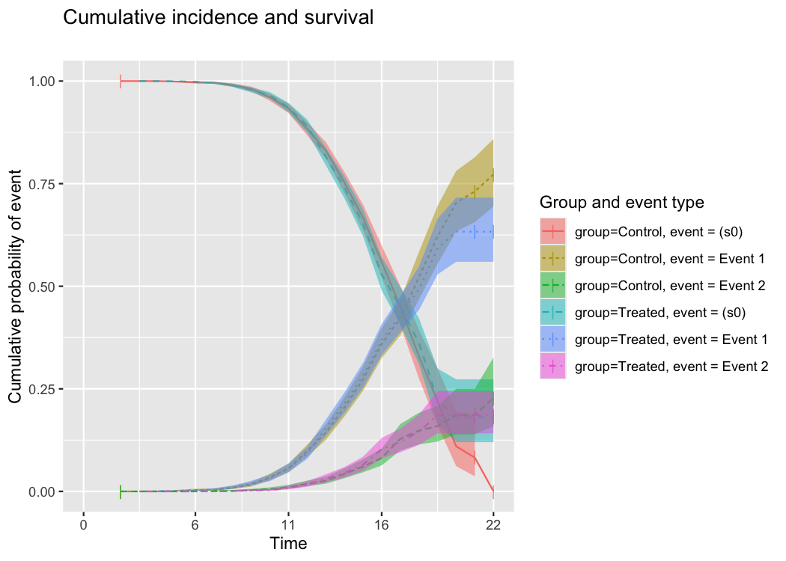

> *Produces a plot with CIF curves for “Event 1” and “Event 2” plus the
> overall KM survival curve for each of the two groups — six lines in
> total.*

<br>

------------------------------------------------------------------------

### 2 · CIF curves only (no survival overlay)

Set `include_surv = FALSE` to hide the survival curve and show only the
cause-specific CIFs.

``` r
plotsurv(fit, include_surv = FALSE)
#> Warning: Removed 4 rows containing missing values or values outside the scale range
#> (`geom_ribbon()`).
#> Warning: Removed 10 rows containing missing values or values outside the scale range
#> (`geom_ribbon()`).
```

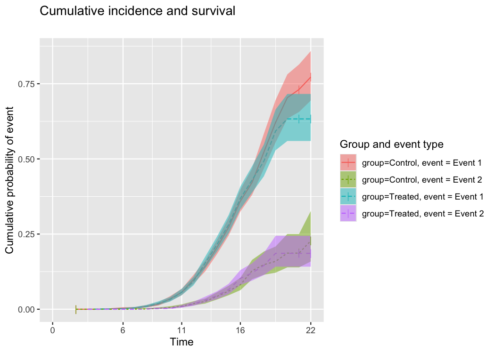

<br>

------------------------------------------------------------------------

### 3 · Adding confidence bands

Confidence bands are shown by default (`conf.int = TRUE`). Set it to
`FALSE` to remove them.

``` r
# Without confidence bands
plotsurv(fit, include_surv = FALSE, conf.int = FALSE)
#> Ignoring unknown labels:
#> • fill : "Group and event type"
```

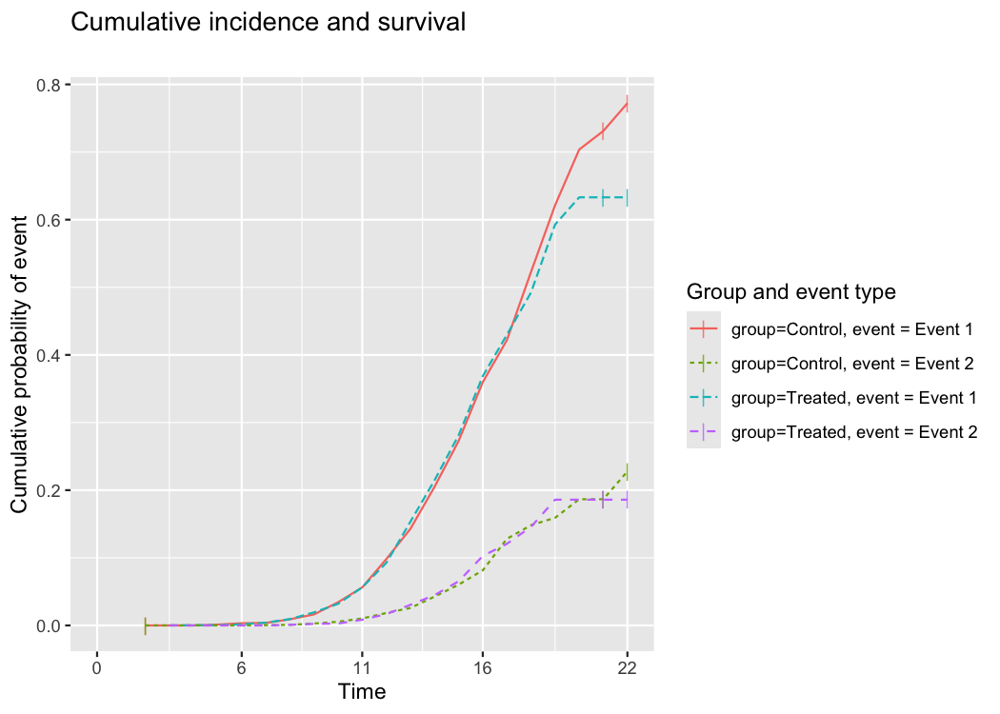

<br>

------------------------------------------------------------------------

### 4 · Adding a risk table

Set `risk.table = TRUE` to attach a numbers-at-risk table below the
plot. The table shows the at-risk count at each of the `x.breaks`
time-points.

``` r
plotsurv(
  fit,
  include_surv = FALSE,
  risk.table   = TRUE,
  x.breaks     = 6
)
#> Warning: Removed 4 rows containing missing values or values outside the scale range
#> (`geom_ribbon()`).
#> Warning: Removed 10 rows containing missing values or values outside the scale range
#> (`geom_ribbon()`).
```

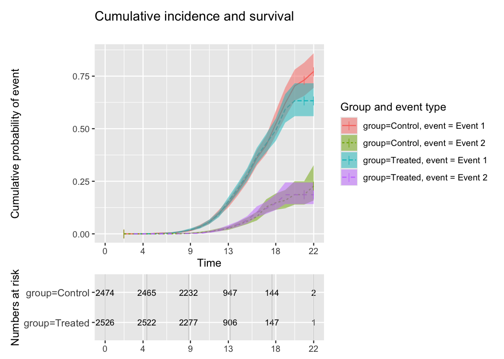

> *The risk table is automatically aligned with the x-axis of the main
> plot.*

<br>

------------------------------------------------------------------------

### 5 · Displaying only one event type

Use `display_event` to restrict which event types are drawn. Pass a
character vector containing the desired event-type label(s) as they
appear in the `factor()` supplied to `Surv()`.

``` r
# Show Event 1 only
plotsurv(
  fit,
  include_surv  = FALSE,
  display_event = "Event 1"
)
#> Warning: Removed 4 rows containing missing values or values outside the scale range
#> (`geom_ribbon()`).
```

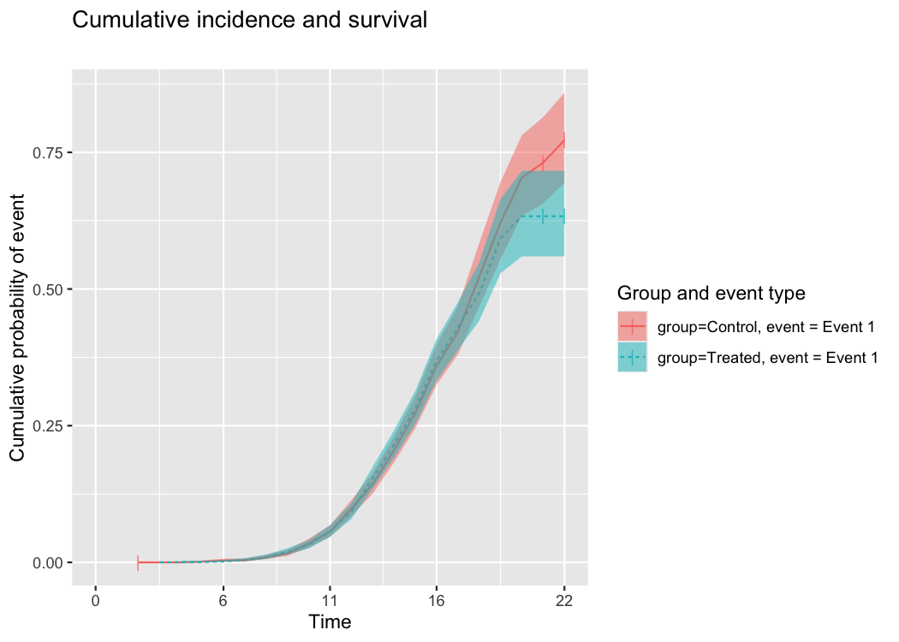

<br>

------------------------------------------------------------------------

### 6 · Customising colors, labels, and titles

#### 6a · Custom title, subtitle, and axis labels

``` r
plotsurv(
  fit,
  include_surv = FALSE,
  conf.int     = FALSE,
  title        = "Competing risks in a simulated trial",
  subtitle     = "5000 participants randomised 1:1",
  x_lab        = "Follow-up time (months)",
  y_lab        = "Cumulative incidence"
)
#> Ignoring unknown labels:
#> • fill : "Group and event type"
```

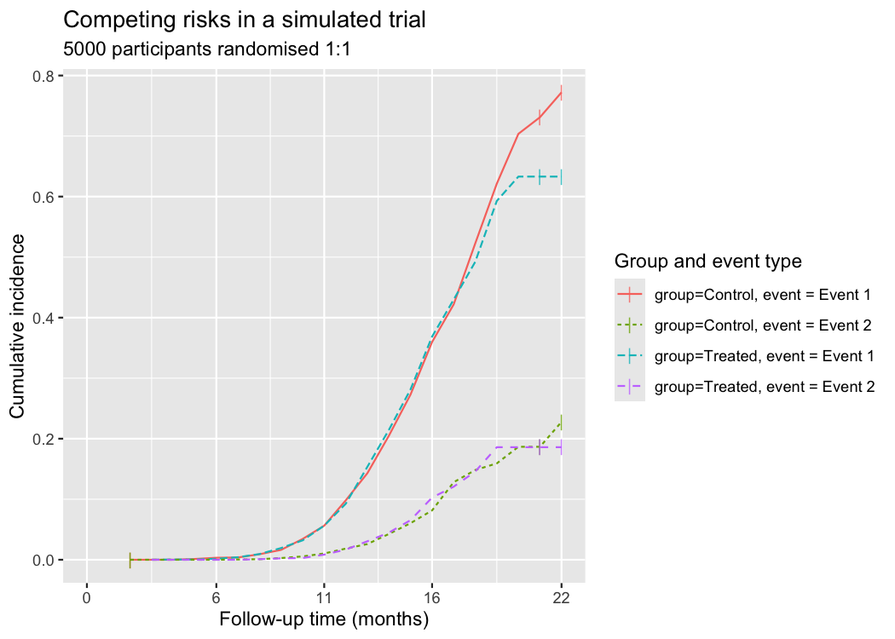

#### 6b · Custom legend labels

The `group_labels` argument renames the legend entries. Labels must be
supplied in the order: group 1 × event 1, group 1 × event 2, …, group k
× event m.

``` r
plotsurv(
  fit,
  include_surv  = FALSE,
  display_event = c("Event 1", "Event 2"),
  color_lab     = "Subgroup",
  fill_lab      = "Subgroup",
  line_lab      = "Subgroup",
  group_labels  = c(
    "Control – Event 1", "Control – Event 2",
    "Treated – Event 1", "Treated – Event 2"
  )
)
#> Warning: Removed 4 rows containing missing values or values outside the scale range
#> (`geom_ribbon()`).
#> Warning: Removed 10 rows containing missing values or values outside the scale range
#> (`geom_ribbon()`).
```

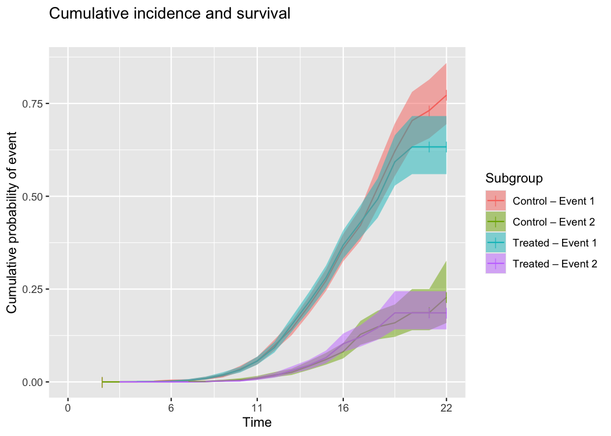

> **Tip:** When `color_lab`, `fill_lab`, and `line_lab` are all set to
> the same string, ggplot2 merges them into a single combined legend.

#### 6c · Custom colors

Pass a vector of hex color codes (or named R colors) to `colors`. Its
length must equal the number of unique strata × event-type combinations
being displayed.

``` r
plotsurv(
  fit,
  include_surv  = FALSE,
  display_event = c("Event 1", "Event 2"),
  group_labels  = c(
    "Control – Event 1", "Control – Event 2",
    "Treated – Event 1", "Treated – Event 2"
  ),
  colors = c("#3A488A", "#8CD3C4", "#BD5630", "#F2A65A")
)
#> Warning: Removed 4 rows containing missing values or values outside the scale range
#> (`geom_ribbon()`).
#> Warning: Removed 10 rows containing missing values or values outside the scale range
#> (`geom_ribbon()`).
```

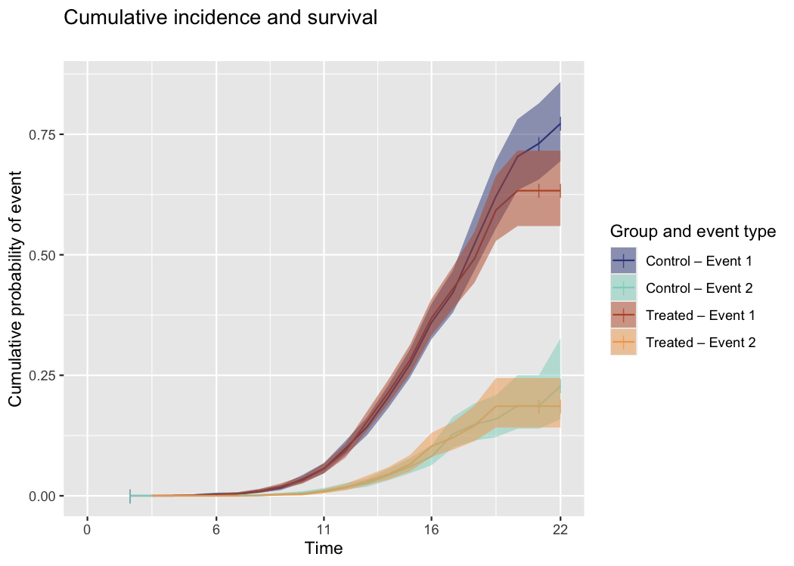

#### 6d · Custom line types

Use `linetypes` to distinguish groups by line style (e.g., solid,
dashed). Accepts any line-type accepted by
`ggplot2::scale_linetype_manual()`.

``` r
plotsurv(
  fit,
  include_surv  = FALSE,
  display_event = "Event 1",
  group_labels  = c("Control", "Treated"),
  linetypes     = c("solid", "dashed")
)
#> Warning: Removed 4 rows containing missing values or values outside the scale range
#> (`geom_ribbon()`).
```

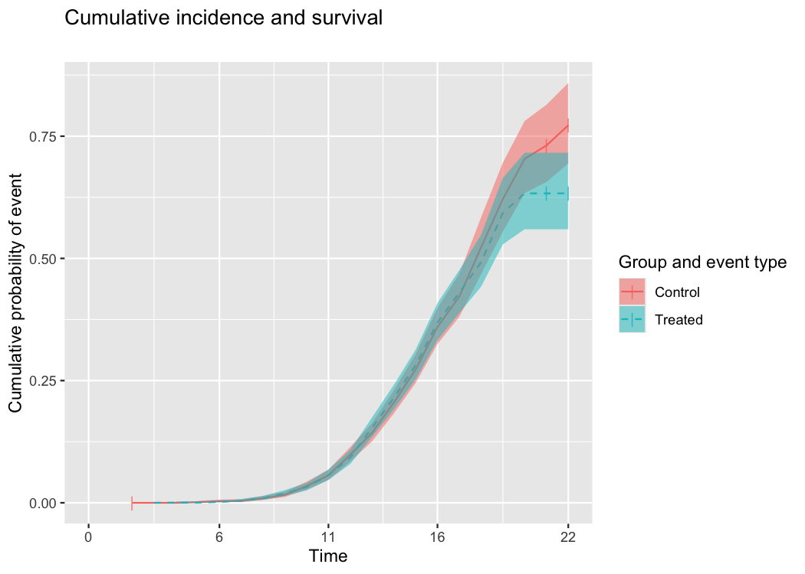

<br>

------------------------------------------------------------------------

### 7 · Customising censoring ticks

Censoring tick marks are enabled by default (`ticks = TRUE`). You can
control their size and transparency:

``` r
plotsurv(
  fit,
  include_surv = FALSE,
  ticks        = TRUE,   # set FALSE to hide ticks
  ticksize     = 5,      # default: 3
  tickalpha    = 0.6     # default: 0.8; lower = more transparent
)
#> Warning: Removed 4 rows containing missing values or values outside the scale range
#> (`geom_ribbon()`).
#> Warning: Removed 10 rows containing missing values or values outside the scale range
#> (`geom_ribbon()`).
```


<br>

------------------------------------------------------------------------

### 8 · Renaming strata labels

By default, strata labels are taken directly from the `survfit` object
(e.g., `group=Control`, `group=Treated`). Use `strata_labels` to
override them:

``` r
plotsurv(
  fit,
  include_surv  = FALSE,
  risk.table = TRUE,
  strata_labels = c("Placebo arm", "Active treatment arm")
)
#> Warning: Removed 4 rows containing missing values or values outside the scale range
#> (`geom_ribbon()`).
#> Warning: Removed 10 rows containing missing values or values outside the scale range
#> (`geom_ribbon()`).
```

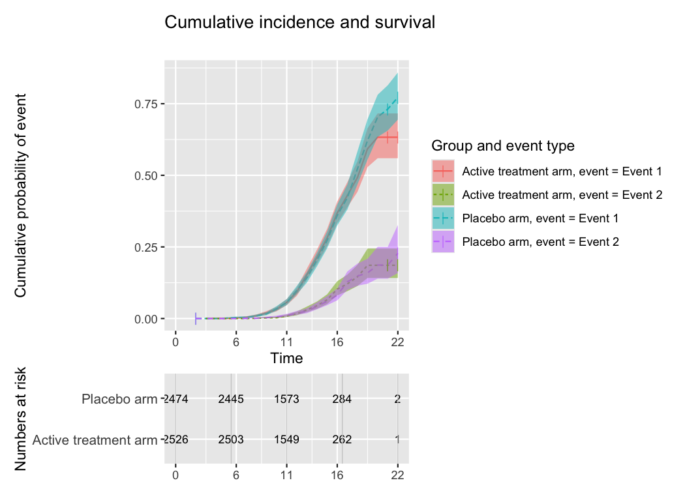

<br>

------------------------------------------------------------------------

### 9 · Comprehensive example

Putting it all together:

``` r
plotsurv(
  fit,
  include_surv  = FALSE,
  conf.int      = TRUE,
  risk.table    = TRUE,
  x.breaks      = 7,
  ticks         = TRUE,
  ticksize      = 5,
  tickalpha     = 0.5,
  display_event = c("Event 1", "Event 2"),
  title         = "Cumulative incidence of competing events",
  subtitle      = "Simulated cohort, n = 500",
  x_lab         = "Months of follow-up",
  y_lab         = "Cumulative incidence",
  color_lab     = "Group & event",
  fill_lab      = "Group & event",
  line_lab      = "Group & event",
  group_labels  = c(
    "Control – Event 1", "Control – Event 2",
    "Treated – Event 1", "Treated – Event 2"
  ),
  colors = c("#3A488A", "#8CD3C4", "#BD5630", "#F2A65A")
)
#> Warning: Removed 4 rows containing missing values or values outside the scale range
#> (`geom_ribbon()`).
#> Warning: Removed 10 rows containing missing values or values outside the scale range
#> (`geom_ribbon()`).
```

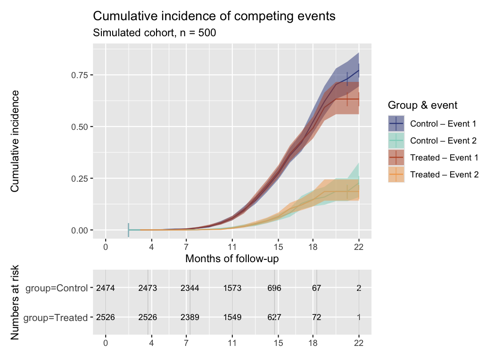

<br>

------------------------------------------------------------------------

## Parameter reference

| Parameter | Type | Default | Description |
|----|----|----|----|
| `survfit_obj` | `survfit` | — | **Required.** The output of `survival::survfit()`. |
| `include_surv` | logical | `TRUE` | Whether to overlay the Kaplan-Meier survival curve S(t). |
| `conf.int` | logical | `TRUE` | Whether to draw confidence bands around each curve. |
| `risk.table` | logical | `FALSE` | Whether to attach a numbers-at-risk table below the plot. |
| `strata_labels` | character | `NULL` | Replacement labels for the strata names taken from the `survfit` object. Length must equal the number of strata. |
| `x.breaks` | integer | `5` | Number of evenly-spaced time-points at which x-axis ticks (and risk-table entries) are placed. |
| `ticks` | logical | `TRUE` | Whether to add vertical tick marks at censoring times. |
| `ticksize` | numeric | `3` | Size of the censoring tick marks (passed to `geom_point(size = ...)`). |
| `tickalpha` | numeric | `0.8` | Transparency of the censoring tick marks (0 = invisible, 1 = opaque). |
| `display_event` | character | `"all"` | Event type(s) to display. `"all"` shows every event state; otherwise pass a character vector of event labels matching those in the `factor()` used inside `Surv()`. |
| `title` | character | `"Cumulative incidence and survival"` | Main plot title. |
| `subtitle` | character | `""` | Plot subtitle (shown below the title). |
| `x_lab` | character | `"Time"` | X-axis label. |
| `y_lab` | character | `"Cumulative probability of event"` | Y-axis label for the main plot. |
| `y_lab_table` | character | `"Numbers at risk"` | Y-axis label for the risk table (only relevant when `risk.table = TRUE`). |
| `color_lab` | character | `"Group and event type"` | Legend title for the color aesthetic. Setting this, `fill_lab`, and `line_lab` to the same string merges the three scales into a single legend. |
| `fill_lab` | character | `"Group and event type"` | Legend title for the fill aesthetic. |
| `line_lab` | character | `"Group and event type"` | Legend title for the linetype aesthetic. |
| `group_labels` | character | `NULL` | Custom legend labels for each stratum × event-type combination. Must have the same length as the number of combinations being displayed. |
| `groups.table` | character | `NULL` | Custom row labels in the at-risk table (only relevant when `risk.table = TRUE`). Must have the same length as the number of strata. |
| `colors` | character | `NULL` | Custom fill/color values. Must have the same length as the number of curves being drawn. If `NULL`, the default ggplot2 color palette is used. |
| `linetypes` | character | `NULL` | Custom linetype values. Must have the same length as the number of curves being drawn. If `NULL`, all curves are drawn with `"solid"` lines. |

<br>

------------------------------------------------------------------------

## Notes on `display_event`

- The *censoring state* (the lowest-numbered factor level in
  `factor(eventtype)`) is stored internally by `survfit` as `"(s0)"`. It
  should **not** be passed to `display_event`.
- By default (`display_event = "all"`), the function shows **all** event
  states including `"(s0)"` (the survival curve), unless
  `include_surv = FALSE`.
- Passing a character vector to `display_event` implicitly also includes
  `"(s0)"` internally, but only the stated event types are drawn
  (control `include_surv` separately to toggle the survival overlay).

<br>

------------------------------------------------------------------------

## Dependencies

`plotsurv` is deliberately lightweight:

| Package     | Role                                       |
|-------------|--------------------------------------------|
| `ggplot2`   | Core plotting engine                       |
| `patchwork` | Combining the main plot and the risk table |
| `dplyr`     | Data manipulation                          |
| `tidyr`     | Data reshaping                             |

<br>

------------------------------------------------------------------------

## License

GPL (≥ 3) — see `LICENSE.md`.

<br>

------------------------------------------------------------------------

*Package developed by [Zheer Kejlberg Al-Mashhadi](https://zheer.dk).*
